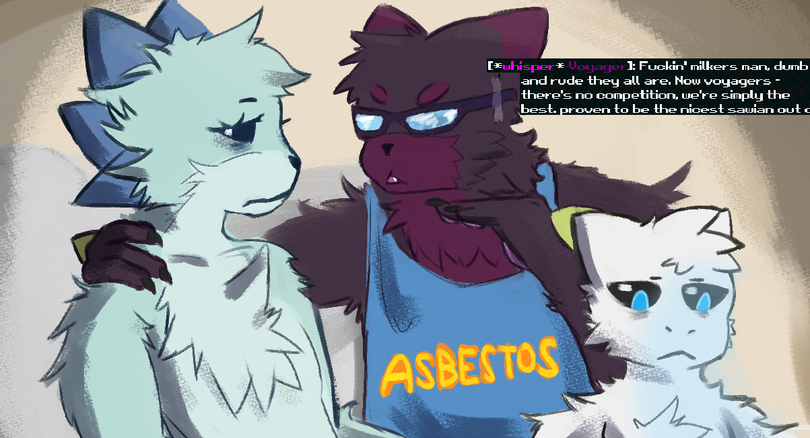

### A mod for adding whispering to the Casualties: Unknown Multiplayer mod

Multiplayer mod: https://www.nexusmods.com/scavprototype/mods/67
(Tested with v4.0.1 and v4.1.2)

Enables short-range communication for chatting with people near you.
Especially useful in lobbies with many people.

Both the host and the client need to have this mod installed for it to work.
You can still whisper to clients that do not have this mod, but they cannot whisper back.

#### Installation

1. Download CasualtiesTogetherWhisper.zip from [Releases](https://github.com/Voxeles/CasualtiesTogetherWhisper/releases)
2. Extract CasualtiesTogetherWhisper.dll to your plugins folder ("Casualties Unknown Demo/BepInEx/plugins")

#### Usage

Begin your chat message with "/w " to send a whisper.
While sending your message, you will see markers above players that will hear you.

You can change the range of your whisper by adding a number after the 'w'.
For example "/w10 message" will be heard only by players 10 tiles away from you.
Default is 20, max is 40.
